# Student Database Management System

A web-based **Student Database Management System (SDBMS)** built using **Python, Flask, MySQL, HTML, CSS, and Bootstrap**.

The system provides an authenticated administrator interface for managing student records through a clean web dashboard.

## Features

### Authentication & Security

* Administrator login
* Secure password hashing using Werkzeug
* Session-based authentication
* Protected administrator routes
* Environment-based configuration using `.env`
* Custom 404 and 500 error pages
* Login history tracking

### Student Management

* Add student records
* View all students
* Search students by Admission Number or Roll Number
* Update student records
* Delete student records with confirmation
* Validation for duplicate Admission Numbers
* Validation for duplicate Roll Numbers
* Mobile number validation
* Student not-found handling
* Empty search/error states

### Dashboard

* Total student count
* Total administrator count
* Recent student records
* Quick access to student management functions

### Data Export

* Export student records as CSV

### Public Website

* Project introduction
* Project highlights
* Technology stack
* Source code link
* Developer information
* Professional/social links
* GitHub QR code
* Resume download
## Screenshots

### Landing Page

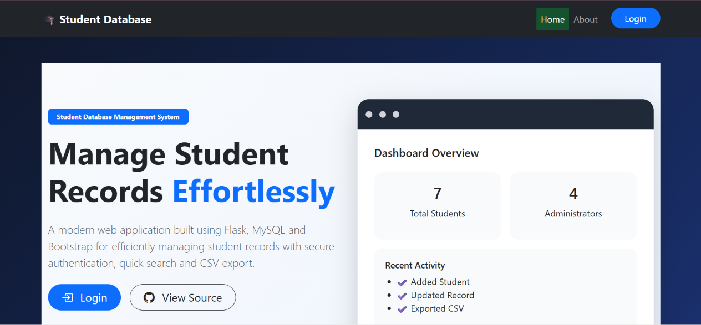

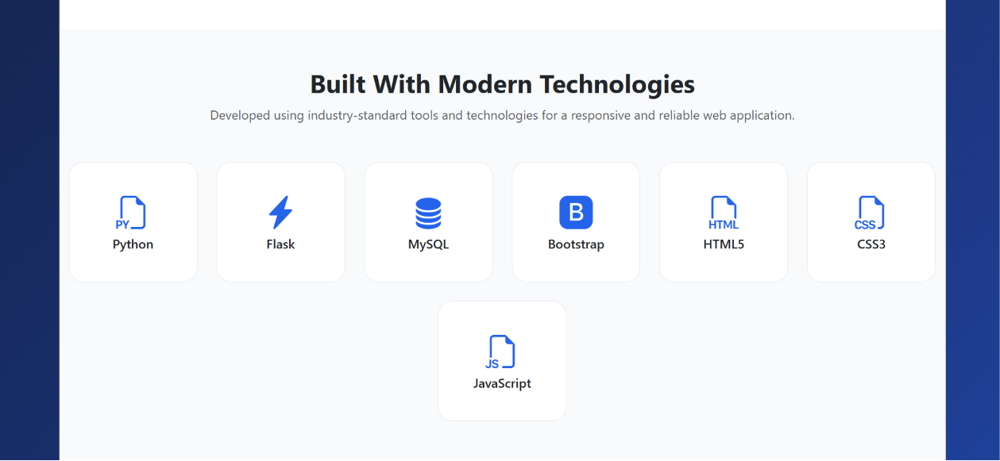

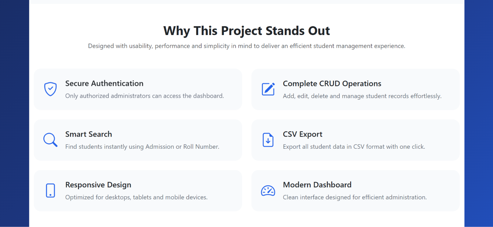

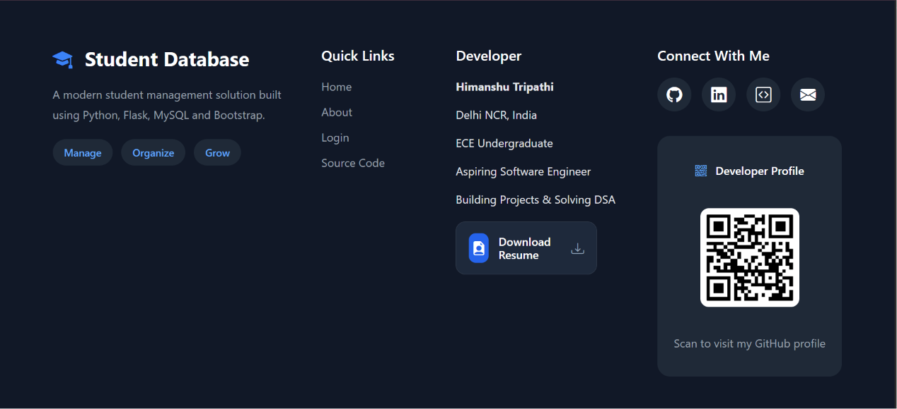

### Application

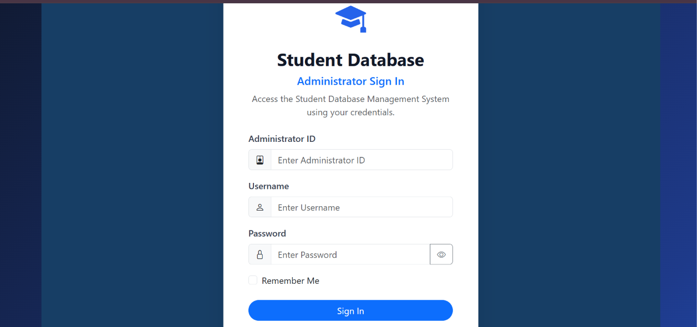

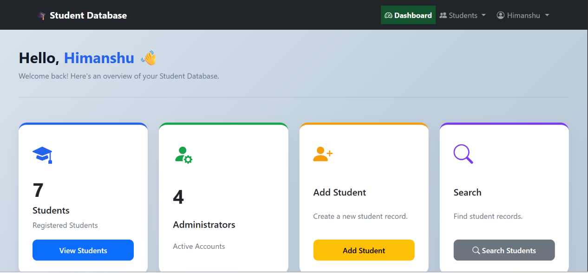

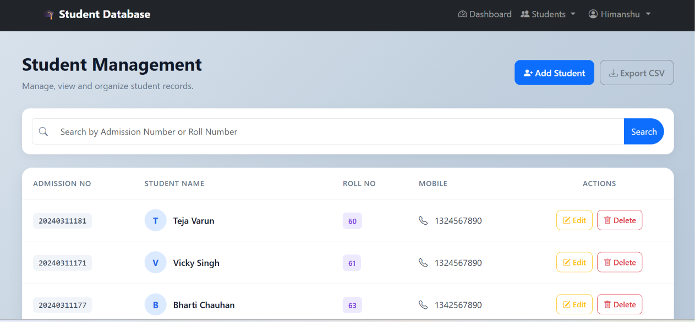

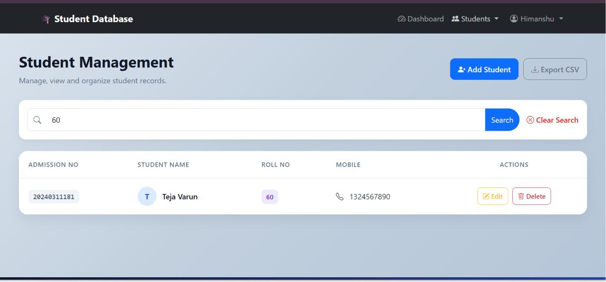

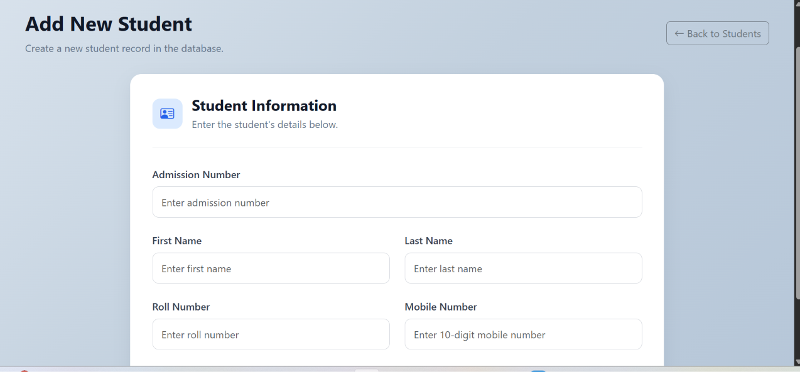

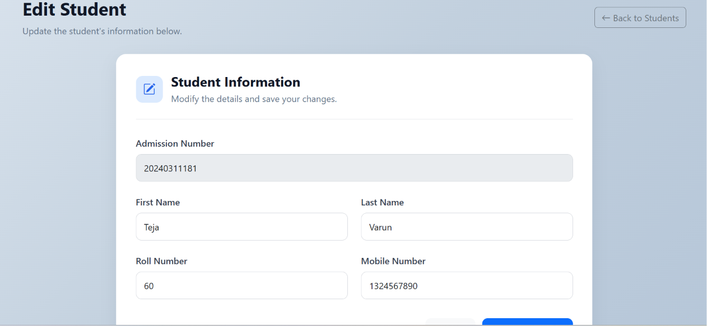

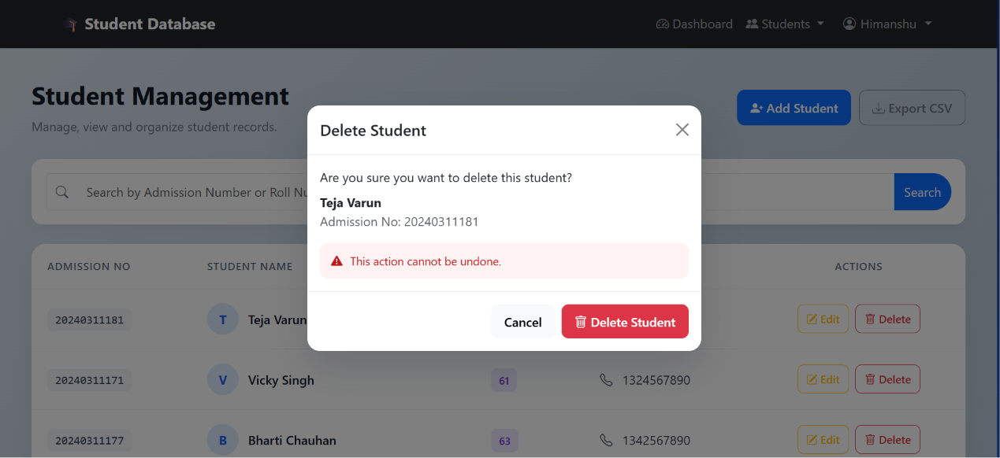

## Technologies Used

* **Python**
* **Flask**
* **MySQL**
* **HTML5**
* **CSS3**
* **Bootstrap 5**
* **Bootstrap Icons**
* **Werkzeug**
* **python-dotenv**
* **Git**
* **GitHub**

## Project Structure

```text
Student-Database-Management-System/
│
├── app.py
├── auth.py
├── config.py
├── database.py
├── students.py
├── utils.py
├── requirements.txt
├── .gitignore
├── .env
├── README.md
│
├── static/
│   ├── files/
│   │   └── himanshu_resume.pdf
│   ├── images/
│   │   └── github-qr.png
│   ├── js/
│   └── style.css
│
└── templates/
    ├── 404.html
    ├── 500.html
    ├── add_student.html
    ├── base_public.html
    ├── dashboard.html
    ├── index.html
    ├── login.html
    ├── student_not_found.html
    ├── students.html
    └── update_student.html
```

## Database

The project uses MySQL for persistent data storage.

The main database tables are:

* `student` — stores student records
* `user_details` — stores administrator account information
* `log_details` — stores login history

The application uses parameterized SQL queries to reduce the risk of SQL injection.

## Installation

### 1. Clone the repository

```bash
git clone https://github.com/himanshu07-12/student-database-management-system
cd Student-Database-Management-System
```

### 2. Create a virtual environment

```bash
python -m venv venv
```

Activate it on Windows:

```bash
venv\Scripts\activate
```

### 3. Install dependencies

```bash
pip install -r requirements.txt
```

### 4. Configure environment variables

Create a `.env` file in the project root:

```env
SECRET_KEY=your_secret_key

DB_HOST=localhost
DB_USER=your_mysql_username
DB_PASSWORD=your_mysql_password
DB_NAME=project
```

Do not commit the `.env` file to GitHub.

### 5. Configure MySQL

Create the required database and tables in MySQL according to the project's database schema.

Update the `.env` values with your local MySQL credentials.

### 6. Run the application

```bash
python app.py
```

The application will be available at:

```text
http://127.0.0.1:5000
```

## Application Flow

```text
Public Website
      │
      ▼
    Login
      │
      ▼
  Dashboard
      │
      ▼
Student Management
      │
 ┌────┼───────────────┐
 ▼    ▼       ▼       ▼
View  Add   Search   Export
 │
 ├── Update
 │
 └── Delete
       │
       ▼
 Confirmation
```

## Security

SDBMS V1 includes several security and reliability measures:

* Passwords are stored using secure password hashing.
* Database queries use parameterized SQL.
* Administrator-only pages require authentication.
* Session data is cleared during logout.
* Sensitive configuration values are stored in environment variables.
* `.env` is excluded through `.gitignore`.
* Flask debug mode is disabled for the finalized application.
* Custom error pages prevent exposing raw application errors to users.
* Input validation is performed before student records are inserted or updated.

## Version

**Current Version: V1.0**

SDBMS V1 focuses on core student management, authentication, dashboard functionality, data export, security, and a polished public interface.

## Future Development — V2.0

Planned Administrator Management features for SDBMS V2.0 include:

* Administrator profile management
* View administrators
* Add administrators
* Administrator access/request form
* Administrator approval workflow
* Password management
* Account activation/deactivation
* Safe administrator deletion
* Role-based permissions
* Super Administrator functionality
* Administrator activity/audit log

The existing `log_details` login-history functionality will serve as part of the foundation for the future administrator activity/audit system.

## Author

**Himanshu Tripathi**

ECE Undergraduate
Aspiring Software Engineer
Building Projects & Solving DSA

